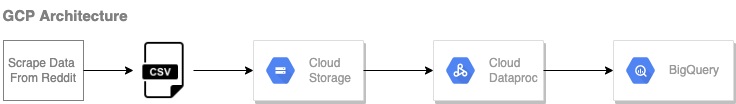

# Sparknlp-text-data-cleaning

### Intro
This

This application uses the following GCP services:
  - Cloud Scheduler (Sends a message to a Cloud Pub/Sub topic at 9 pm)
  - Cloud Pub/Sub
  - Cloud Function (Scrape )
  - Cloud Run (Deploys the containeraized streamlit application)
  - Cloud Storage
  - Container Registry (Manages Docker images)

---

### GCP Architecture
The whole architecture is like the picture below.

---

### App Display

